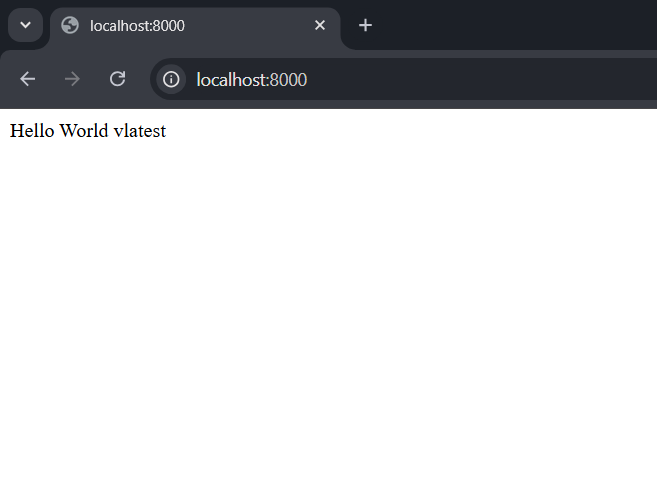

# PHP Hello World Dockerize

This repository contains a simple PHP "Hello World" application that can be containerized using Docker. The application serves the "Hello World" message using Apache.

---

## Steps to Reproduce

### Step 1: Install Docker and Docker Compose

1. Open your Ubuntu terminal.
2. Install Docker and Docker Compose using the following commands:
   ```bash
   sudo apt update
   sudo apt install docker.io
   sudo apt install docker-compose
   ```

### Step 2: Fork and Clone the Repository

1. Fork the repository from PHP Hello World Repository https://github.com/silarhi/php-hello-world.
2. Clone the repository:
   ```bash
   git clone https://github.com/<your-username>/php-hello-world.git
   ```
3. Navigate to the cloned repository:
   ```bash
   cd php-hello-world
   ```
4. Open the repository in a code editor like VS Code.

### Step 3: Add index.php

1. Create a file named index.php in the root directory (php-hello-world/).
2. Add the following code:

   ```php
   <?php
   require_once __DIR__ . '/src/HelloInterface.php';
   require_once __DIR__ . '/src/Hello.php';

   use Silarhi\Hello;

   $hello = new Hello();
   echo $hello->display();
   ```

### Step 4: Add a Dockerfile

1. Create a Dockerfile in the root directory (php-hello-world/).
2. Add the following content:
   ```dockerfile
   FROM php:7.4-apache
   COPY . /var/www/html/
   EXPOSE 80
   CMD ["apache2-foreground"]
   ```

### Step 5: Build the Docker Image

1. Build the image using the Dockerfile:
   ```bash
   sudo docker build -t php-hello-world .
   ```

### Step 6: Log in to Docker Hub

1. Log in to your Docker Hub account:
   ```bash
   docker login -u <your-dockerhub-username>
   ```
2. Enter your Docker Hub password or Personal Access Token (PAT).

### Step 7: Push the Image to Docker Hub

1. Tag the Docker image:
   ```bash
   docker tag php-hello-world:latest <your-dockerhub-username>/php-hello-world:latest
   ```
2. Push the image to Docker Hub:
   ```bash
   docker push <your-dockerhub-username>/php-hello-world:latest
   ```

### Step 8: Add a Docker Compose File

1. Create a docker-compose.yml file in the root directory.
2. Add the following content:
   ```yaml
   version: "3"
   services:
     app:
       image: <your-dockerhub-username>/php-hello-world:latest
       ports:
         - "8000:80"
   ```

### Step 9: Build and Run Docker Compose

1. Use Docker Compose to build and run the application:
   ```bash
   sudo docker-compose build
   sudo docker-compose up -d
   ```

### Step 10: Access the Application

1. Open your browser and go to http://localhost:8000
2. You should see the output: Hello World vlatest

---

## Screenshots

### 1. Application running in the browser.



### 2. Docker Hub repository showing the pushed image.


### 3. Docker images and containers.


